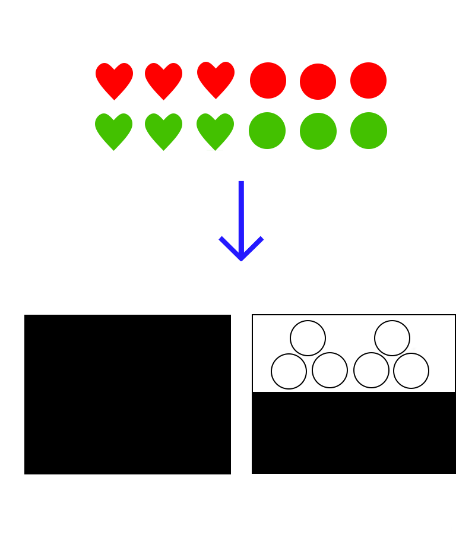
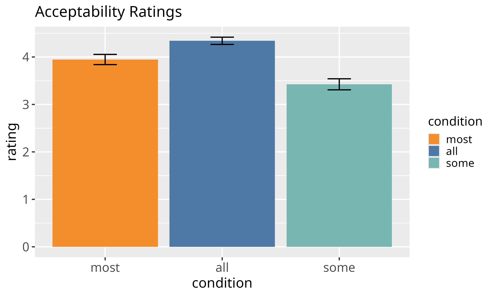
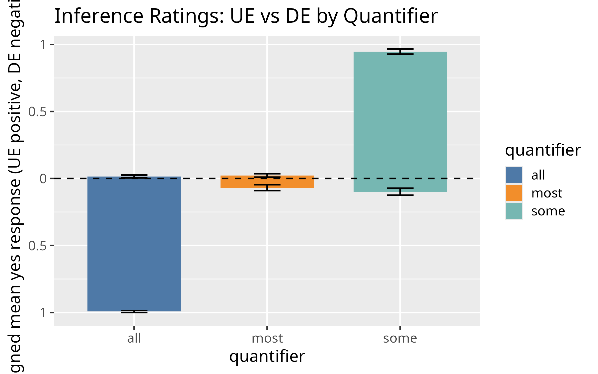

## Background

### The Classic Problem with NPIs

- **Negative Polarity Items (NPIs)** traditionally analyzed as markers of downward entailment (DI)
- NPIs like "even the least" (*sebemenší*)
- Classical view: NPIs require downward-entailing (DE) environments

:::: {.columns}
::: {.column width="50%"}
**Classic Example (English):**

- ✓ "Nobody found any cat"
- ✗ "Someone found any cat"

:::
::: {.column width="50%"}
**Czech Example:**

- *Nikdo nenašel sebemenší* ... (nobody found even the least)
- But what about "most"?

:::
::::

## The Challenge: Mixed Evidence

- **Szabolcsi et al. (2008):** No correlation between DI and NPI licensing
- **Chemla et al. (2011), Denić et al. (2021):** Suggested relationship based on judgments
- **Barker (2018):** Alternative proposal
  - NPIs signal **narrow scope**, not monotonicity

## Alternative Hypothesis

**Barker's Scope-Marking View:**

> NPIs signal narrow scope with respect to their licensor, not necessarily monotonicity

**Implication:** NPIs might be licensed even in non-monotonic environments!

## The Key Test Case: "Most" (Vetšina)

:::: {.columns}
::: {.column width="70%"}
**Proportional Quantifier:**

$$[[\text{vetšina} ]](A)(B) = 1 \text{ iff } |A \cap B| > |A \setminus B|$$

- NOT downward-entailing
- NOT upward-entailing
- **Genuinely non-monotonic**

:::
::: {.column width="30%"}
Example:

- Most circles are in the box
- ⇸ Most shapes are in the box (fails!)
- ⇸ Most green circles in the box (fails!)

:::
::::

## Research Question

> **Can NPIs be licensed in genuinely non-monotonic environments?**

If YES: This supports Barker's scope view, not Ladusaw's monotonicity view!

---

## Experiment Design

### Overview: Two-Part Study

1. **Acceptability Task:** Do speakers accept NPIs with "all", "most", "some"?
2. **Inference Task:** What inference patterns do speakers show for these quantifiers?

### Participants

- N = 24 (acceptability-first condition)
- N = 29 (inference-first condition)
- Tested for order effects (found none)

## Experiment Part 1: Acceptability Task

### Design
- **Factorial:** 1×3 design (9 items)
- **Quantifier factor:** DE (*all*), NM (*most*), UE (*some*)
- **Scale:** 1-5 Likert

### Example Item

:::{.fragment}

   ```
   Všichni / Většina / Některí občané se sebemenší vírou v Boha
   chtěli nalezenému dítěti vystrojit křest.
   ```

   **Translation:**
   > "All / Most / Some of the citizens with even the least faith in God
   > wanted to arrange a christening for the found child."

:::

### Prediction

Expected acceptability order: **all > most > some**

## Experiment Part 2: Inference Task

### Design
- **2×3 factorial:** 18 items total
- **Binary factor:** UE vs. DE entailment direction
  - UE: circles → shapes
  - DE: circles → green circles
- **Ternary factor:** Quantifier (all/most/some)

---

### Visual Setup

Participants saw images with shapes in different colors:

:::: {.columns}
::: {.column width="50%"}
{width="100%"}
:::
::: {.column width="50%"}
{width="100%"}
:::
::::

## Inference Task (Continued)

### Procedure

1. See image (e.g., 6 red circles, 6 green circles)
2. Told: shapes will go in two boxes, one has opaque walls, one has window
3. Asked: Does Sentence A entail Sentence B?

### Example

```
Sentence A: All of the circles are in the box on the right.
Sentence B: All of the shapes are in the box on the right.

Question: Does A entail B? (Yes/No)
```

---

### Predictions

- **all:** "Yes" for DE (circles→shapes? No; circles→green circles? Yes)
- **some:** "Yes" for UE (upward inferences)
- **most:** "No" for both (should show no monotonic pattern)

## Key Inference Task Images

{width="70%"}

## Results: Acceptability Ratings

{width="85%"}

---

### Statistical Analysis
- **Bayesian linear mixed models** (random intercepts for participants)
- **all vs. most:** β = 0.43 [0.18, 0.67], **BF₁₀ = 5.14** ✓
- **some vs. most:** β = -0.49 [-0.73, -0.24], **BF₁₀ = 24.6** ✓

**Means:** all (4.34) > most (3.95) > some (3.42)

## Results: Inference Patterns

{width="85%"}

## Inference Results: Statistical Details

### Bayesian Logistic Mixed Models

**Effect of Quantifier:**

- **all** robustly endorses DE inferences: β = -8.51, **BF₁₀ = 9.20×10⁵** ✓
  - Rejects UE, accepts DE
- **some** robustly endorses UE inferences: β = 7.09, **BF₁₀ = 3.50×10⁸** ✓
  - Accepts UE, rejects DE
- **most** shows NO clear pattern: β = -1.30, **BF₀₁ = 1.06** ✓
  - DE: 6.8%, UE: 2.3% (both near floor!)

## The Critical Dissociation

:::: {.columns}
::: {.column width="50%"}
**Acceptability**

- all: 4.34 ✓✓
- most: 3.95 ✓
- some: 3.42

:::
::: {.column width="50%"}
**Monotonicity**

- all: 100% DE ✓✓
- most: Neither! ✓
- some: 100% UE

:::
::::

### Key Finding

> **"Most" licenses NPIs at intermediate acceptability levels DESPITE being genuinely non-monotonic**

---

## Discussion

### Challenge to Ladusaw (1979)

**Ladusaw's Hypothesis:**

> Downward entailment is a synchronic licensing condition for NPIs

**Our Evidence:**

- "Most" is empirically non-monotonic (BF₀₁ = 1.06)
- Yet it still licenses NPIs at intermediate levels
- This is STRONGER evidence than double licensing (which uses monotonic operators)

## Supporting Barker's Alternative

### Barker (2018): Scope-Marking View

NPIs signal **narrow scope** relative to their licensor:

$$\exists d \, [\text{vetšina}_x(F(x,d) \rightarrow P(x))]$$

Cannot infer:

$$\text{vetšina}_x((\exists d \, F(x,d)) \rightarrow P(x))$$

**Why this works with "most":**

- There may be a threshold of faith degree that guarantees acceptability
- First formula can be true while second is false
- NPI takes narrow scope within restrictor (*sebemenší vírou* = "least faith")

## Comparing Quantifiers

The monotonicity landscape:

- **all (DE):** Maximum downward reasoning → highest acceptability
- **most (NM):** No monotonic pattern → intermediate acceptability
- **some (UE):** Maximum upward reasoning → lowest acceptability

This gradient is incompatible with synchronic DE requirement but aligns perfectly with scope theory!

## Diachronic vs. Synchronic

### Historical vs. Contemporary

- **Diachronically** (historically): NPIs may have grammaticalized in DE environments
- **Synchronically** (in modern Czech): Downward inference is NOT necessary
- Only **narrow scope** is required

---

## Main Contributions

1. **Replicates** Szabolcsi et al. (2008) null finding
2. **Extends** to theoretically critical case: empirically non-monotonic quantifier
3. **Provides stronger evidence** against DI-NPI link than double licensing alone
4. **Supports** Barker's (2018) scope-marking view over classical monotonicity theory

## Broader Implications

- NPI licensing is **domain-sensitive** (Homer 2021)
- What matters is **scope relations**, not logical monotonicity
- Classical analyses based on semantic features may miss pragmatic mechanisms
- Experimental evidence crucial for testing competing theories

## Takeaway

> **Scope triumphs over monotonicity: NPIs mark narrow scope, not downward entailment**

---

## References

:::: {.columns}

::: {.column width="50%" style="font-size: 0.7em;"}

- Alexandropoulou, S., L. Bylinina, and R. Nouwen (2020). Is there any licensing in non-DE contexts? *Proceedings of Sinn und Bedeutung 24(1)*, 35–47.
- Barker, C. (2018). Negative polarity as scope marking. *Linguistics and Philosophy*, 41(5), 483–510.
- Barwise, J. and R. Cooper (1981). Generalized quantifiers and natural language. *Linguistics and Philosophy*, 4(2), 159–219.
- Chemla, E., V. Homer, and D. Rothschild (2011). Modularity and intuitions in formal semantics. *Linguistics and Philosophy*, 34, 537–570.

:::

::: {.column width="50%" style="font-size: 0.7em;"}

- Denić, M., V. Homer, D. Rothschild, and E. Chemla (2021). The influence of polarity items on inferential judgments. *Cognition*, 215, 104791.
- Homer, V. (2021). Domains of polarity items. *Journal of Semantics*, 38(1), 1–48.
- Ladusaw, W. A. (1979). *Polarity Sensitivity as Inherent Scope Relations*. Ph.D. thesis, University of Texas.
- Szabolcsi, A., L. Bott, and B. McElree (2008). The effect of negative polarity items on inference verification. *Journal of Semantics*, 25(4), 411–450.

:::

::::
